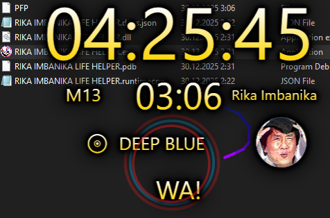
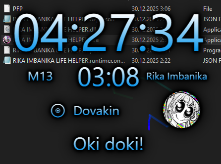
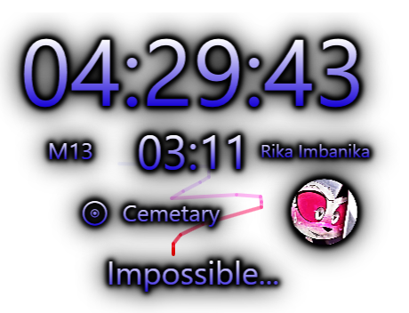
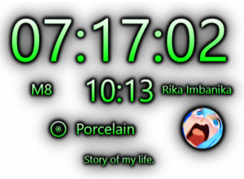

## <b>RIKA IMBANIKA LIFE HELPER</b>

Made on WPF, c#. App builds in Visual Studio.

Timer + audio player + mouse effects + funny motivation quotes + avatars + clocks.
#

  

You can change params (and quotes) in "HELPER PROGRAM FILES"

Possibly this app can help concentrate when you have ADHD. And distract too.

LMB + Ctrl - size changing

2 clicks - next track

Many clicks - restart timer

3 right mouse clicks - pause / continue

Timer continues after restarting app.

When timer reach 24 hours it restart from 00 and add +1 to M (Like M7 -> M8)